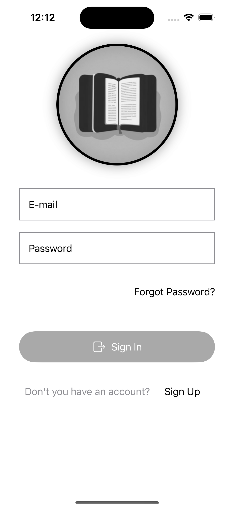
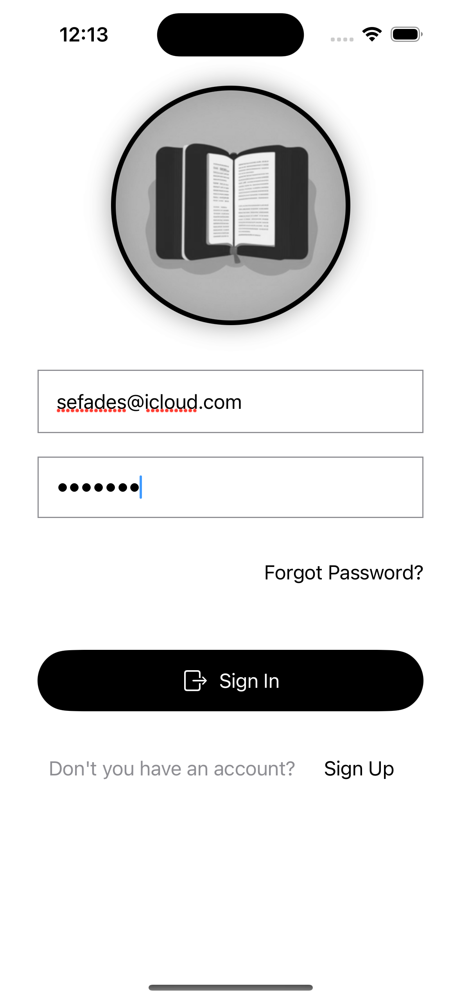
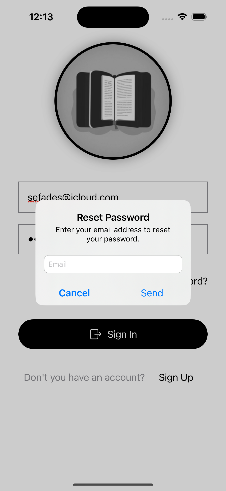
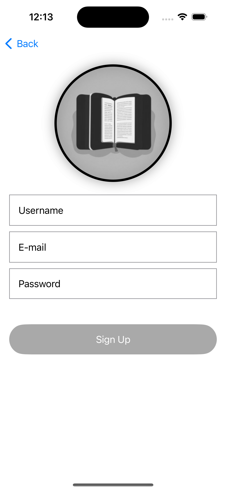
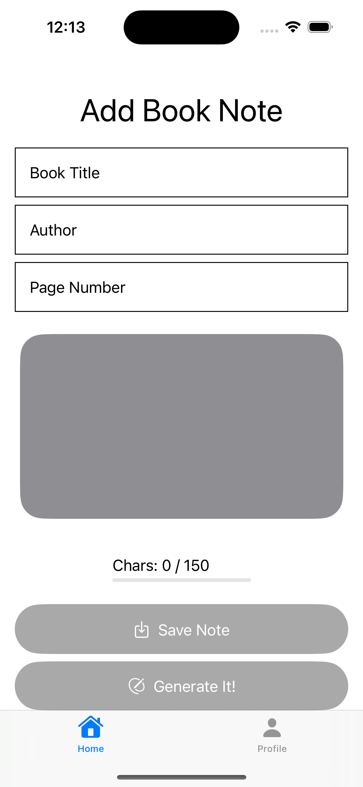
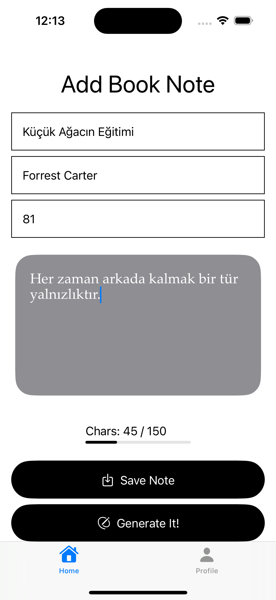
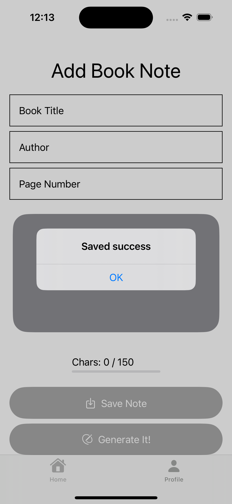
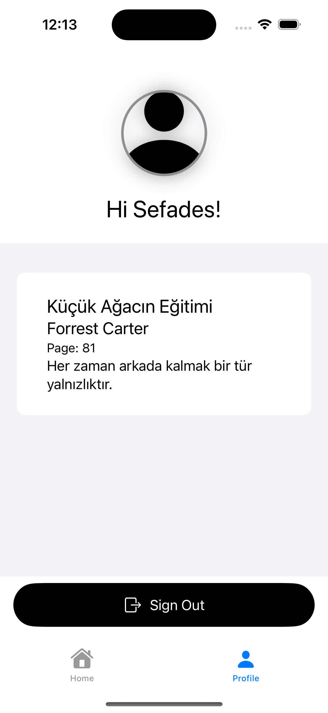
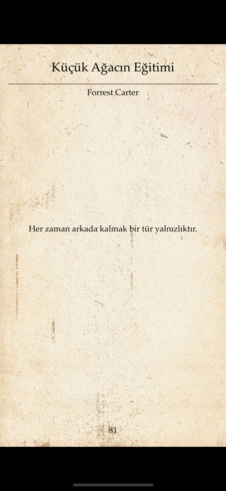

# ReadNote
Taking book quote app with SwiftUI and Firebase

# Giriş Yap

# Giriş Yap Aktif

# Parolamı Unuttum

# Kayıt Ol

# Ana Ekran

# Ana Ekran Aktif

# Butona Basıldı

# Profil

# Sonuç

